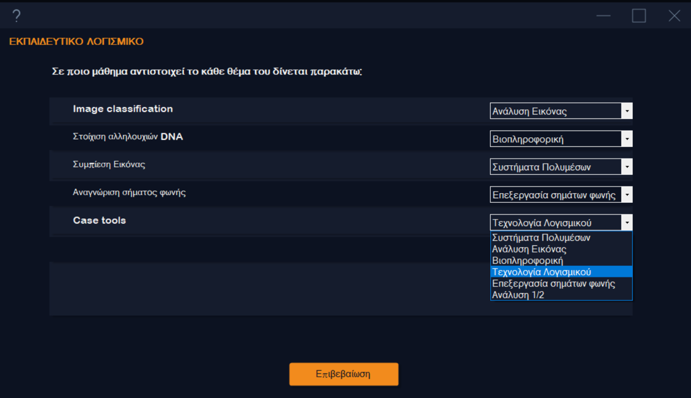

# Educational Software for Computer Science
This is a desktop app aimed to educate students about the available computer science specializations. The app is in Greek and was made as a demo for a university project.

# Screenshots

Main window
<p float="middle">

</p>

<p float="middle">

</p>

<p float="middle">

</p>


Quiz example
<p float="middle">
  
   
</p>

<p float="middle">
  
   
</p>

# Details

## Environment
The programming language is ```C#``` with ```.NET Framework Version 4.7.2```. It is also accompanied by a MySQL database.

## Custom WinForm Controls
Great emphasis was given to the overall look of the app. This project contains some custom controls which we have found on the internet over the years and we spent time rewriting and improving them. The custom controls in this project are:

1. **ShadowPanel**: works just like the WinForm Panel.
2. **RoundedButton** and **RoundedToggleButton**: visually appealing Button and Checkbox
3. **FormFlat**: a custom class that makes it easy to turn any Form into a custom themed flat window
